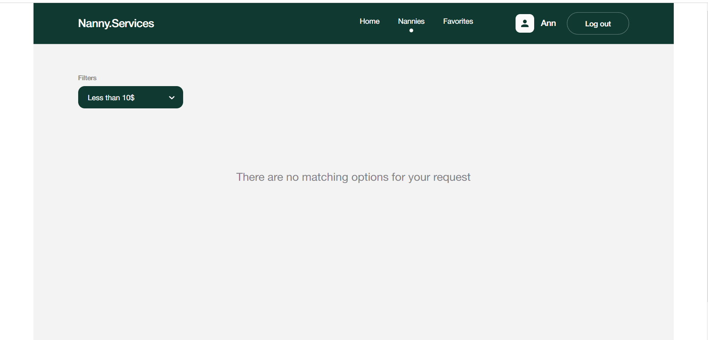

Welcome to the page of my application to find a nanny for your child. The home page has a navigation menu to navigate the site and buttons to register and log into your account.

When you click on the registration button, a modal window opens for you to register in the application and create an account.

When you click on the login button, a modal window opens to log into your account in the application.

You can also get to the Nannies page by clicking on the Get started button.

Upon successful registration and login to your account, you get access to your private Favorites page, where you can see a list of your favorite nannies.

You can add to favorites by clicking on the favorites button in the nanny’s card. After this, the card will appear on your Favorites page, where you can edit the list, deleting unnecessary cards.

On the Nannies and Favorites pages you have the opportunity to sort the list of available nannies based on your request.

The Nanny and Favorites pages contain a short description of each nanny.

When you click on the Read More button, a full card opens with reviews about the nanny and a button for booking a visit.

When you click on the Make an appointment button, a modal window opens with a form for booking a nanny's visit.

### Project made with

- 
- 
- 
- 
- 
- 
- 
- 
- 
